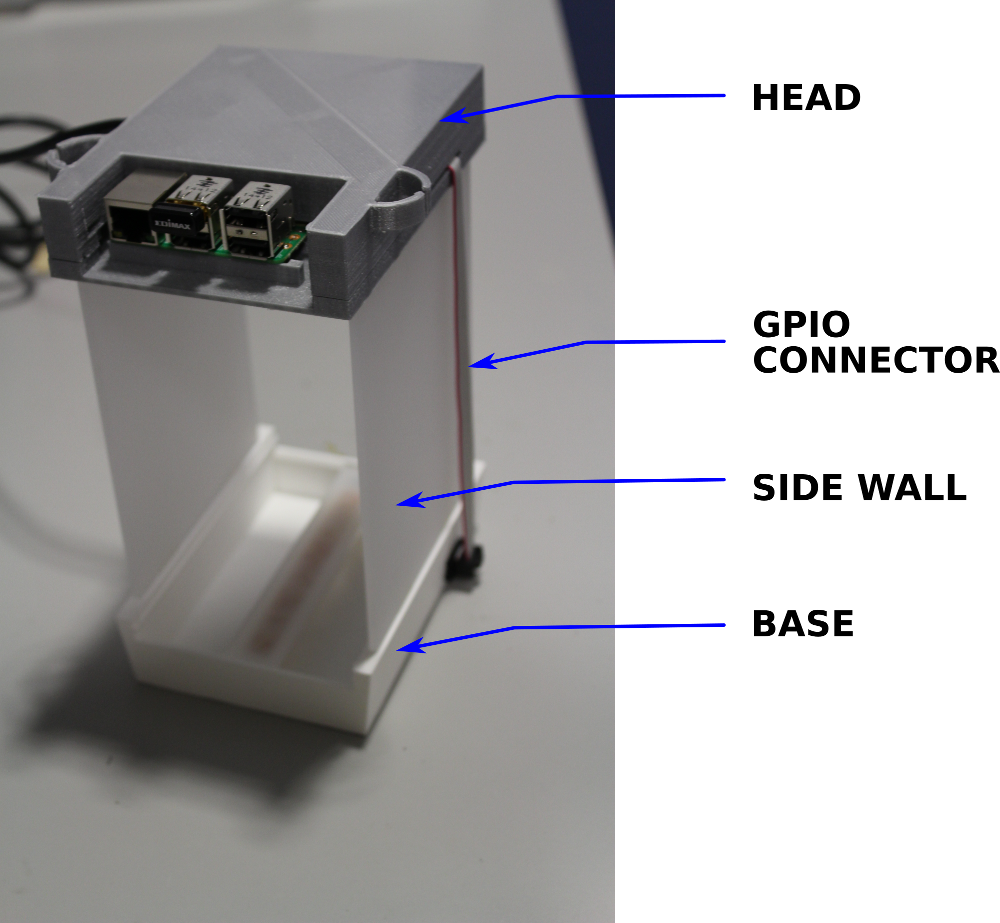
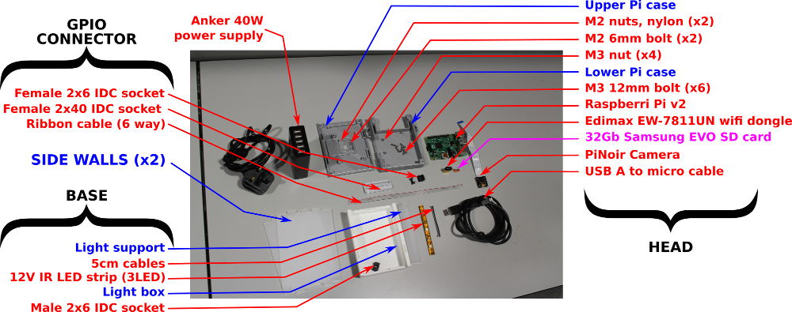
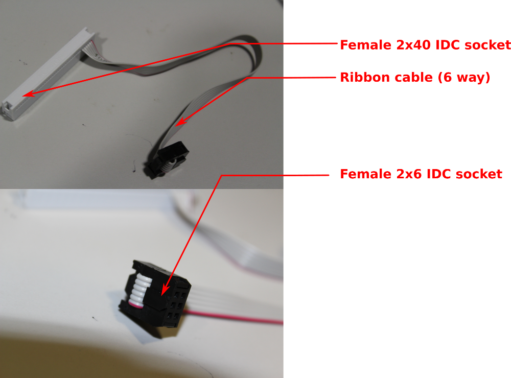
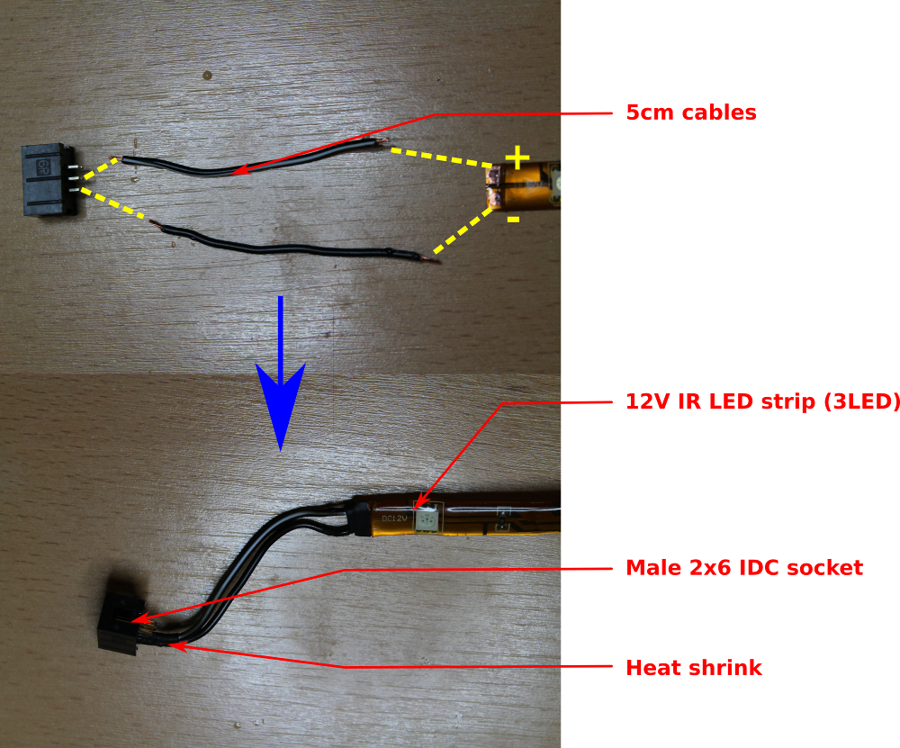
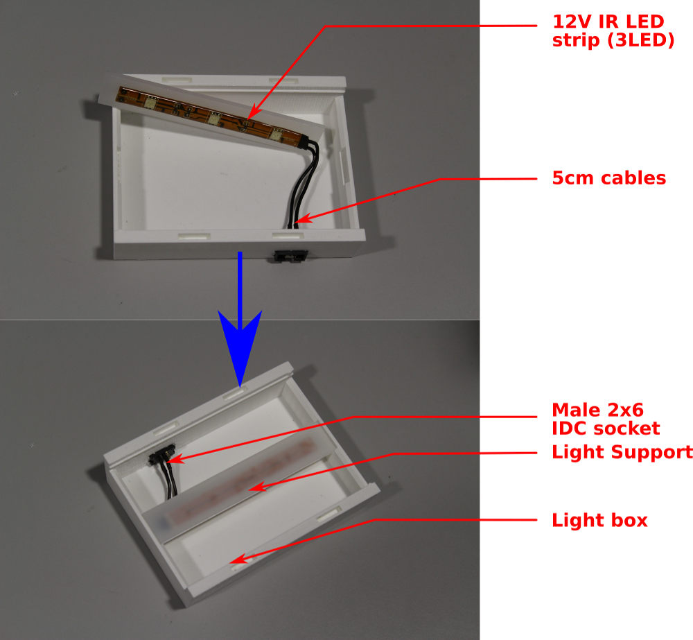
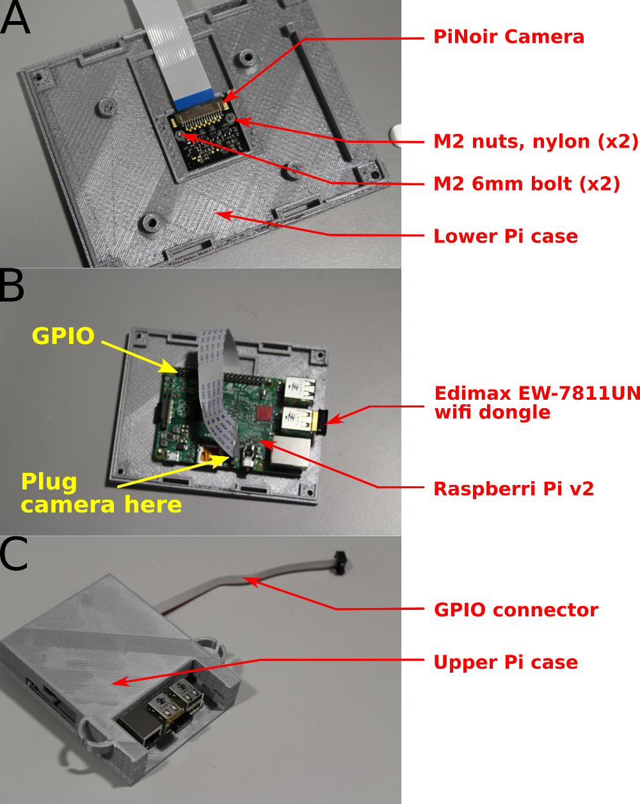

Ethoscope core
==============

This document describes the core of the ethoscope device.
That is the device without arena or extra modules.
The core of the device is made of three parts:

* the **head**, which holds the Raspebbery Pi an the camera.
* the **base**, which diffuses light though different types of arenas (read about arenas [here](TODO)).
* the **side walls**, which connect the base to the head.

An assembled core looks like this:

Building a core
------------------

A list of all components (or BOM) is available [here](./BOM.csv).

So before we start, we should have something like:

In addition, you will need several tools and consumables such as:

* Allen keys
* soldering iron
* super glue
* heat shrink
* solder wire (lead free).

GPIO connector
----------------

In order to power the infrared (IR) light, the General Purpose Input Output (GPIO) of the  Raspberry Pi is connected to the base by a ribbon cable.
We can build a simple connector that looks like that:

Here, we have used a **21cm long** 6 way ribbon cable.

Base
-----------------

The base acts as an IR light box.
The idea is to emit IR light down, so it can be reflected upward.

In order to put the light together, a little bit of basic soldering is required:

The yellow dashed lined indicate where we need to solder.

You can also notice that **heat shrink** have been put around the wires so that we ensure proper insulation.

After is has been soldered, the led strip must be passed **from the outside** to the inside, by the connector hole.
Then, we can stick the light to its support, and glue the support to the side of the base:

Head
--------------------
The head is the single most important part of the device.
It is made of a Raspberry Pi, and peripherals, enclosed by pair(lower and upper) of 3d printed parts.

The steps to build the head are the following:

1. Generate a **SD card**  (it contains the operating system and all the software used by the ethoscope).
2. Plug the SD card in the Pi.
3. Place the **camera** on the lower part, and screw from the outside using M2 bolts along with the nylon nuts (sub-picture A, below).
4. Position the **Raspberry Pi** in the lower part, above the camera, and screw it from the outside, with two M3 bolts (sub-picture B, below).
5. Connect the camera, the **GPIO connector** and the wireless dongle to the Pi.
6. In the upper part, there are four holes in the corners. They allow us to close the box with screws. You want to **insert a nut in each slit** under the hole,
7. Now, we can **close the box** (sub-picture C, below) and screw the upper and lower parts together, using four M3 screws.
8. The last thing we want to do is plugging the micro-usb power supply in the Pi.

Last bits:
Before you can start working, you will have to **change the focus of the camera**.
I am afraid this has to be done manually. A very good explanation is available here(TODO).

